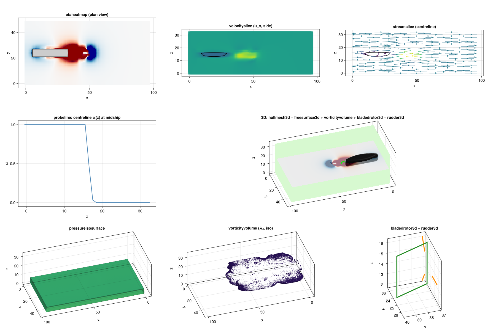

# ShipMakie.jl

Makie recipes for the foam ship-CFD stack. Reusable plot types for
WaterLily / VoF / Turbulence / LiftingSurfaces / ShipShapes outputs.



## Recipes (13)

### 2D

| Recipe              | What it draws                                  |
|---------------------|------------------------------------------------|
| `etaheatmap`        | Free-surface elevation η(x, y) from α          |
| `velocityslice`     | Velocity-component heatmap on a coord slice    |
| `streamslice`       | 2D streamlines on a coord slice                |
| `vectorslice`       | 2D velocity arrows on a coord slice            |
| `hullsilhouette`    | Body silhouette contour from an SDF            |
| `probeline`         | 1D field profile along x/y/z                   |

### 3D

| Recipe                | What it draws                                |
|-----------------------|----------------------------------------------|
| `freesurface3d`       | Water surface as a coloured height mesh      |
| `vorticityvolume`     | ω_mag or λ₂ volume rendering (iso / MIP)     |
| `hullmesh3d`          | Hull mesh from an SDF (Marching Cubes)       |
| `bladedrotor3d`       | BladedRotor blade wireframe                  |
| `rudder3d`            | Rudder flat-plate wireframe + δ rotation     |
| `pressureisosurface`  | ±iso surfaces of a pressure field            |
| `streamlines3d`       | RK4-integrated 3D streamlines from seeds     |

### Conventions

All recipes follow Makie conventions: `etaheatmap(α; …)` creates a new
figure/axis, `etaheatmap!(ax, α; …)` plots into an existing axis. The
input observables are reactive — passing an `Observable{Array}` makes
the plot update when the array changes (use this for animations).

## Quick start

```julia
using CairoMakie, ShipMakie

# Free-surface elevation
fig, ax, p = etaheatmap(vof.α; waterline_z = NZ/2,
                                colorrange = (-0.4, 0.4))

# Centreline velocity slice with hull silhouette overlay
ax2 = Axis(fig[1, 2])
velocityslice!(ax2, sim.flow.u; slice_axis = :y, component = 1)
hullsilhouette!(ax2, p -> wigley_sdf(p, L, B, T);
    grid_size = size(vof.α), slice_axis = :y)
```

For 3D scenes use `GLMakie` (headless via `xvfb-run` works fine):

```julia
using GLMakie, ShipMakie
GLMakie.activate!()

fig = Figure(size = (1400, 1000))
ax = Axis3(fig[1, 1]; aspect = :data,
    azimuth = 0.4π, elevation = 0.2π)

# Layer everything in one Axis3
hullmesh3d!(ax, hull_sdf;          grid_size = size(vof.α))
freesurface3d!(ax, vof.α;          waterline_z = H_w_c, alpha = 0.55)
vorticityvolume!(ax, sim.flow.u;   field = :omega_mag)
bladedrotor3d!(ax, 3, R, R_hub;    center = (px, py, pz), color = :red)
rudder3d!(ax, chord, span;         center = (rx, ry, rz), δ = deg2rad(8))
```

## Presets

- `ShipMakie.default_scene(u, α; hull_sdf, …)` — return a 4-panel
  `Figure` (η plan + u_x side slice + streamslice + 3D scene). The
  fastest path to "let me see my sim".
- `ShipMakie.record_default_scene(filename, u_obs, α_obs, step!;
   nframes, …)` — wraps `default_scene` + `Makie.record` to record
  an animation by repeatedly calling `step!()`. See
  `docs/cookbook.md` for the calling pattern.

## Examples

See `examples/`:

- `moving_ship_vortices.jl` — 3-panel animated demo (η + side-slice + 3D)
- `headline_4panel.jl` — 4-panel showcase (η, u_x, streamlines, 3D scene)
- `ultra_3d_scene.jl` — single-Axis3 scene with rotating camera
- `showcase_all.jl` — every recipe in one figure
- `streamlines_demo.jl` — 3D streamlines around the hull
- `particle_tracer_animation.jl` — 200 live-advected particles, 100 frames
- `hero_image.jl` — high-res hero render
- `kelvin_wake.jl` — classical 19.47° V-shape in a long domain
- `kelvin_fr_sweep.jl` — Fr-invariance of the wedge across 4 Fr values

Run with `xvfb-run -a julia examples/<name>.jl` for headless 3D, or
`USE_GL=0 julia examples/<name>.jl` to force CairoMakie (2D only).

## Cookbook

`docs/cookbook.md` has a worked example for every recipe plus
layering recommendations and the animation pattern.

## Design notes

- **Only depends on `Makie`** — backend choice (CairoMakie / GLMakie /
  WGLMakie) is left to the downstream user.
- **No simulation logic**. The recipes are thin shims over WaterLily's
  face-staggered velocity convention. Use them as the visualisation
  layer for any cell-centred CFD output that matches the layout.
- **Observable-friendly**. All input arrays go through `lift(...)` so
  the plots respond to time evolution without per-frame rebuild cost.
- **Cell-units convention**. Cell `I` has centre at world `I - 1.5`
  (WaterLily ghost convention). Cell-centre coords are emitted on the
  output axes so heatmaps overlay cleanly.

## Testing

```bash
julia --project -e 'using Pkg; Pkg.test()'
```

28 tests across 16 testsets pass. Tests use CairoMakie under the hood;
3D recipes are also verified there but the resulting volume/contour
visuals only look correct with GLMakie.

## License

MIT.
